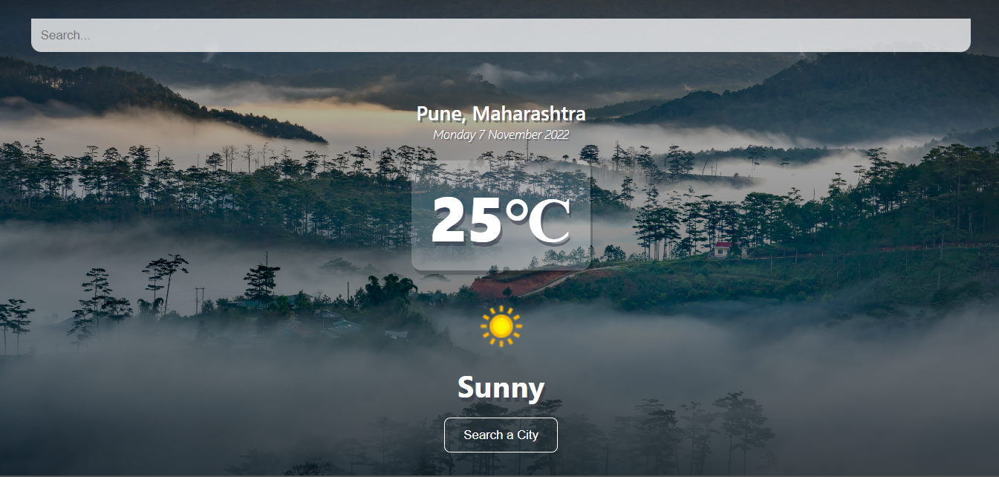

## Weather App
This weather app shows the weather details of your city and you can also know weather of any city by searching .

## Installation

```
$npm install
```
```bash
npm run dev
# or
yarn dev
```

## App Configuraion
Get your API key here: [https://rapidapi.com/weatherapi/api/weatherapi-com]("https://rapidapi.com/weatherapi/api/weatherapi-com/")


**Important Instructions**
- Create env vriable inside ` next.config.js ` 
  ```
  env:{
    apiKey: ' write api-key here'
  }
  ```
- To access the API key in your file:
    ```
    ${process.env.apiKey}
    ```



